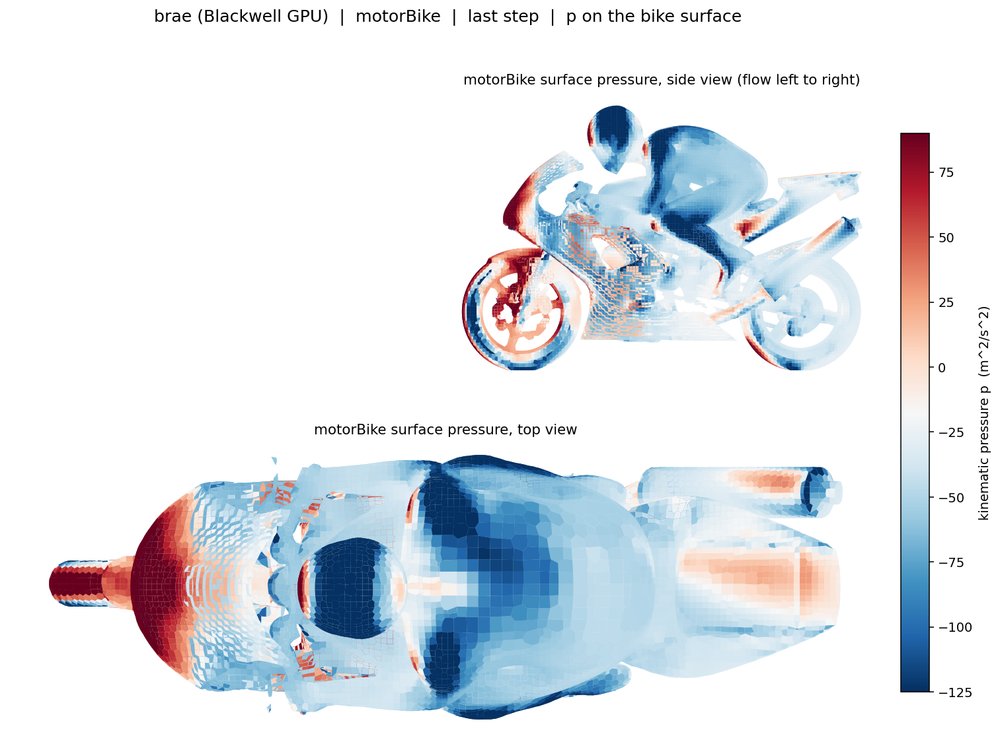
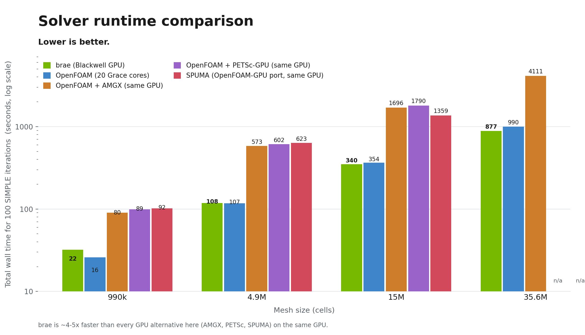

<p align="center">
  
</p>


<p align="center"><b>GPU-native computational fluid dynamics, OpenFOAM-compatible, fully resident on the GPU.</b></p>

<p align="center">
  
  
  
  
  
  
</p>

Brae keeps the whole CFD solve on one GPU. The mesh, the fields, and every linear solve stay on the device from the
first iteration to the last, with no per-iteration copies to the CPU. Point it at an existing OpenFOAM case and it
writes standard OpenFOAM results, so it drops into your workflow unchanged.

Most "OpenFOAM on GPU" approaches offload only the linear solver: the matrix is rebuilt on the CPU and copied to the
GPU every iteration, while assembly, momentum and turbulence still run on one CPU core. Brae is **device-resident** —
the entire iteration lives on the GPU — so there is no migration tax and no serial-CPU ceiling.

---

## 🌊 Will it run my case?

You always type `brae`. It reads the `application` entry your case already has in `controlDict` and runs the matching
solver, so a transient case needs no different command.

| solver | what |
|---|---|
| [`simpleFoam`](docs/solvers/simplefoam.md) | steady incompressible |
| [`pimpleFoam`](docs/solvers/pimplefoam.md) | transient incompressible — URANS / DES / LES |
| `rhoSimpleFoam` | **steady compressible**, subsonic and transonic |

| | supported |
|---|---|
| **turbulence** | kEpsilon · realizableKE · kOmegaSST · kOmegaSSTLM · SpalartAllmaras · Smagorinsky · WALE · SA-DDES/IDDES · kOmegaSST-DDES/IDDES · laminar · generalizedNewtonian |
| **thermo** | hePsiThermo · heRhoThermo · perfectGas · hConst · sutherland · const · liquid (NSRDS correlations, OpenFOAM's own `he→T` inversion) |
| **convection** | upwind · linearUpwind · linearUpwindV · LUST · linear · limitedLinear · limitedLinearV · vanAlbada |
| **pressure–velocity** | SIMPLE · SIMPLEC (`consistent yes`) · PIMPLE · transonic |
| **time** | steadyState · Euler · backward · CrankNicolson |
| **boundaries** | fixedValue · zeroGradient · noSlip · slip · symmetry · symmetryPlane · wedge · empty · cyclic · cyclicAMI · inletOutlet · outletInlet · totalPressure · fixedFluxPressure · pressureInletOutletVelocity · flowRateInletVelocity · freestream · surfaceNormalFixedValue · uniformFixedValue · codedFixedValue · fixedMean · turbulentIntensityKineticEnergyInlet · turbulentMixingLengthDissipationRateInlet · nutk/epsilon/omega/kqR wall functions · externalWallHeatFluxTemperature |
| **fvOptions** | explicitPorositySource · limitTemperature · fixedTemperatureConstraint · scalarFixedValueConstraint · MRF |

Anything outside that list **stops at start-up, named** — see [When brae can't](#-when-brae-cant) below.

Coming soon: `interFoam` (two-phase VoF).

---

## 🎯 Is the answer right?

**All six rhoSimpleFoam tutorials OpenFOAM v2412 ships run as shipped**, held against real OpenFOAM iteration by
iteration. Worst field, worst of iterations 1–3, relative:

| tutorial | cells | host arm | CUDA arm |
|---|---:|---:|---:|
| aerofoilNACA0012 | 16,000 | 2.8e-12 | 2.8e-12 |
| angledDuctExplicitFixedCoeff | 28,000 | 1.6e-10 | 1.2e-10 |
| squareBend (transonic) | 112,000 | 5.5e-10 | 6.6e-11 |
| squareBendLiq | 112,000 | 1.9e-12 | 1.9e-12 |
| squareBendLiqNoNewtonian | 112,000 | 5.8e-13 | 5.5e-13 |

Two different comparisons get confused constantly, so both are stated here:

- **Operator level** — both codes given the identical state, advanced one iteration. This measures the port, and it is
  the table above: 1e-10 to 1e-13.
- **End to end** — both codes run their own 100+ iterations from the same start. Small differences compound through a
  nonlinear fixed-point iteration; squareBend reads ~8e-03 on p at iteration 100. That is two nearby trajectories
  toward the same fixed point, not a discretisation error. Quote it with the iteration count attached.

**478 validation gates** back this. Each takes its right-hand side from OpenFOAM's own output — never a hand-computed
expectation — and carries a control that fails when the thing under test is broken.

### motorBike, 2.9M cells, k-omega SST

brae, OpenFOAM on the CPU, its AMGX and PETSc GPU offloads, and the SPUMA port produce a visually identical
surface-pressure field and agree to ~1.6% on drag.

| brae (Blackwell GPU) | OpenFOAM (Grace CPU) |
|:---:|:---:|
|  |  |
| **OpenFOAM + AMGX (GPU)** | **OpenFOAM + PETSc (GPU)** |
|  |  |
| **SPUMA (OpenFOAM-GPU port)** |  |
|  |  |

See the [full five-way comparison](bench/results/simpleFoam/motorbike_comparison.md) for drag and lift.

---

## ⚡ How fast, and where the crossover is


*aerofoilNACA0012, 15k to 10M cells. One GH200 against all 64 Grace cores.*

The shape matters more than any single ratio. brae plateaus at **9.2 million cell-iterations/s** from about a million
cells up, while **OpenFOAM's curve turns down** past 1M (2.3 → 1.1) as it hits the memory-bandwidth wall. That is why
the gap widens with mesh size — and why it is narrow, or absent, on small meshes.

rhoSimpleFoam, fixed 100 SIMPLE iterations, solver wall only, one GPU against the whole CPU box:

| case | cells | brae (GH200) | OpenFOAM 64c | ratio |
|---|---:|---:|---:|---:|
| aerofoilNACA0012 | 10,000,000 | 108.2 s | 916.7 s | **8.47×** |
| aerofoilNACA0012 | 1,024,000 | 11.1 s | 44.5 s | 4.00× |
| squareBendLiq | 896,000 | 6.8 s | 8.4 s | 1.24× |
| squareBend | 112,000 | 1.6 s | 1.8 s | 1.14× |
| squareBendLiq | 112,000 | 1.7 s | 1.6 s | **0.92×** |

The last row stays in on purpose. **Below roughly 10⁵ cells a GH200 is not the right tool** and brae does not pretend
otherwise; the advantage is a scaling one and it arrives around a million cells.

For simpleFoam on an **H100**, at matched accuracy (under 1% on the fields): **26–30×** faster than OpenFOAM's own GPU
offloads (AMGX, PETSc), **3.9×** faster than the [SPUMA](https://gitlab-hpc.cineca.it/exafoam/spuma) OpenFOAM-GPU port,
**2.5×** faster than a 24-core CPU node.



*That chart is a GB10, the conservative baseline: with no HBM its GPU shares the CPU's memory, so there it reaches
about 5× over the offloads and parity with the CPU. On the H100's HBM the same code widens to 26–30×.*

Full method, per-case tables and the five-way comparison: [docs/performance.md](docs/performance.md) and the
[H100 report](bench/H100/H100_GPU_COMPARISON_REPORT.md).

---

## 🛑 When brae can't

A silent substitution — running `upwind` where your case said `limitedLinear`, and not saying so — is the defect this
project exists to catch. So every path that does less than your case asked for says so on stderr, with a stable,
greppable prefix:

| prefix | meaning |
|---|---|
| `brae NOTICE [ignored]` | the case asked for something and brae does nothing with it |
| `brae NOTICE [approximated]` | brae does something **related but not equal** — a scheme downgrade or formula substitution |
| `brae NOTICE [defaulted]` | brae could not read a value and fell back |
| `brae NOTICE [equivalent]` | an exact equivalence, reported separately so it is not mistaken for an approximation |
| `brae NOTICE [unread]` | dictionary entries brae never consulted — *evidence* of an unimplemented input, not proof |
| `brae WARNING` | running a near-equivalent that is **not** OF-bit-identical |
| **refusal** | brae stops and names it |

The rule, from the source:

> A notice is for *"less than asked, but still a defensible answer"*; a refusal is for *"this answer would be wrong"*.
> When in doubt, throw — brae's contract is that it never guesses.

The `[unread]` audit is worth knowing about: brae reports dictionary entries it never looked at, so a setting that
silently did nothing shows up in your log instead of in your results three weeks later. Silence it with
`BRAE_DICT_AUDIT=0`.

---

## 📦 Install

```bash
curl -fsSL https://brae.sh/install.sh | sh
```

Needs an NVIDIA GPU (Ampere or newer, including H100 / GH200 / B200), CUDA 12.4+ (13.x recommended), and a C++17
toolchain. Brae is standard CUDA, so a newer architecture is just a recompile. **OpenFOAM itself is not required** —
brae reads and writes OpenFOAM cases with its own I/O; you need OpenFOAM only if you want to compare against it.

<details>
<summary>Or build from source</summary>

```bash
# deps: cmake >= 3.24, CUDA toolkit, an MPI (OpenMPI), SCOTCH, zlib
git clone https://github.com/simd-ai/brae.git
cd brae
cmake -B build -DCMAKE_CUDA_ARCHITECTURES=<your_arch>
cmake --build build -j --target brae brae_pimpleFoam brae_rhoSimpleFoam
```

`brae` is the only command you type, but each solver is its own binary and `brae` hands the case over to the one the
`application` entry names — so build and install all three, side by side.

| GPU | `<your_arch>` |
|---|---:|
| GB10 | 121 |
| RTX 50-series | 120 |
| GB300 / B300 | 103 |
| B200 / GB200 | 100 |
| H100 / GH200 | 90 |
| RTX 40-series / L40 | 89 |
| RTX 30-series | 86 |
| A100 | 80 |

</details>

---

## 🚀 Get started

Run brae from inside any OpenFOAM case, exactly as you would run `simpleFoam` or `rhoSimpleFoam` itself:

```bash
cd yourCase                       # your OpenFOAM case (0/  constant/  system/)
brae                              # solve in the current directory (steady, transient or compressible)
brae -case /path/to/yourCase      # or run it from anywhere
brae -partition -case yourCase    # optional: cache the mesh + AMG once, then later runs start warm
brae --help                       # all options
```

No `decomposePar`, brae auto-partitions for the GPU. The [fast path](docs/performance.md) (device-resident solver +
mixed-precision multigrid) is on by default; opt out with `BRAE_PCG_DEVICE=0 BRAE_AMG_FP32=0`.

### Run several cases across GPUs

Run a mesh-independence study or a parameter sweep, one case per GPU (extras queue as GPUs free up):

```bash
brae -cases mesh_coarse mesh_medium mesh_fine   # one case per GPU
BRAE_JOBS=2 brae -cases caseA caseB caseC       # cap how many run at once
```

Each case's residual output is tagged `[GPUn case]`, and it ends with a per-case summary. On a single GPU the cases
run back to back. Override the detected GPU count with `BRAE_GPUS`.

---

## 📐 Known limitations

- **Single GPU.** The whole mesh is resident on one device, which is what removes the domain-decomposition
  approximation OpenFOAM pays in parallel — and what caps the problem size at one device's memory.
- **Non-orthogonal meshes, compressible.** rhoSimpleFoam's iteration-1 velocity sits 2.4e-04 to 3.1e-03 from OpenFOAM
  on a 16° non-orthogonal mesh, against 1.9e-09 on an orthogonal one. Scheme-independent, not yet localised. The
  accuracy figures above are orthogonal-mesh figures.
- **Not bit-identical** to OpenFOAM, and not meant to be — the GPU reorders the floating-point sums.

---

## 📚 Documentation

- [Getting started](docs/getting-started.md), install, first run, verifying against OpenFOAM
- [Performance & tuning](docs/performance.md), the `BRAE_*` knobs and benchmarks
- [Memory model](docs/memory-model.md), device pool vs pinned, LDU-gather vs CSR
- [Roadmap](docs/roadmap.md), scope and what is coming next
