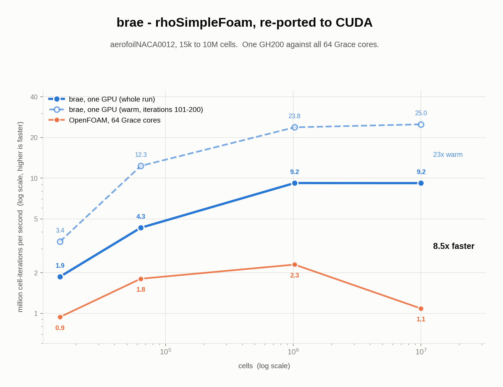

# Performance & tuning

## The one idea: residency

Most GPU approaches offload only the linear solve. The matrix is rebuilt on the CPU and copied to the GPU every
iteration, so assembly, momentum and turbulence stay on one CPU core.

| | where the work runs |
|---|---|
| OpenFOAM + AMGX / PETSc | assembly on CPU, linear solve on GPU, **matrix copied every iteration** |
| SPUMA | GPU fork on unified memory — full residency, no per-iteration copy |
| **brae** | **mesh, fields and every solve stay on the device from first iteration to last** |

## The fast path (on by default)

Two optimisations, both **accuracy-preserving** and **on by default**. Opt out by setting either to `0`.

| flag (default on) | what it does | accuracy |
|---|---|---|
| `BRAE_PCG_DEVICE` | keeps the pressure PCG's Krylov loop resident on the GPU (removes a per-iteration CPU sync) | bit-identical to the host path at iteration 1; same converged state |
| `BRAE_AMG_FP32` | runs the bandwidth-bound multigrid preconditioner in FP32 (half the bytes); the outer solve stays FP64 | bit-identical (mixed precision is confined to the preconditioner) |

Other tuning knobs (advanced; sensible defaults):

| flag | effect |
|---|---|
| `BRAE_AMG_GS=1` | multicolor Gauss-Seidel smoother (vs the default Jacobi), fewer cycles on some anisotropic meshes |
| `BRAE_AMG_TSGS=1` | two-stage Gauss-Seidel (parallel polynomial) smoother, coloring-free |
| `BRAE_AMG_SA=1` | smoothed-aggregation multigrid (vs default pairwise), stronger on cyclic / graded meshes |
| `BRAE_GS_DEVICE=1` | device-resident k/ε Gauss-Seidel scalar solve |

## Benchmarks

| | |
|---|---|
| **measured** | total wall for 100 SIMPLE iterations, scaled-pitzDaily |
| **hardware** | one NVIDIA GB10 — 20 Grace cores + one Blackwell GPU, unified LPDDR5x, **no HBM** |
| **excluded, both sides** | one-time prep: `decomposePar` for OpenFOAM, `brae -partition` for brae (caches mesh + AMG, see [Run it](../README.md#-run-it)) |

| cells | **brae** (Blackwell GPU) | OpenFOAM (20 Grace cores) | OpenFOAM+AMGX (same GPU) | OpenFOAM+PETSc-GPU (same GPU) | SPUMA (same GPU) |
|---|---:|---:|---:|---:|---:|
| 990k | 21.6 s | 15.9 s | 80.0 s | 89.3 s | 92.4 s |
| 4.89M | 107.7 s | 107.0 s | 572.5 s | 601.6 s | 623.2 s |
| 10.28M | 232.5 s | 228.8 s | 1174.2 s | 1253.0 s | 1056.3 s |
| 14.97M | 339.6 s | 354.4 s | 1696.4 s | 1790.3 s | 1359.3 s |
| 35.6M | 877.1 s | 990.4 s | 4111.0 s | - | —¹ |

SPUMA is the [CINECA / EU-exaFOAM OpenFOAM-GPU port](https://gitlab-hpc.cineca.it/exafoam/spuma) (a full GPU fork
of OpenFOAM on unified memory), the closest full-residency peer to brae. ¹ SPUMA diverged to NaN on the extreme
35.6M scaled mesh at stock solver settings.

**Reading it:**

- **~4-5× faster than every other GPU approach** on the *same* GPU, OpenFOAM's own AMGX/PETSc offloads **and** the
  SPUMA port, at every size, the residency payoff.
- **SPUMA is a full-residency port, not an offload** (a GPU fork of OpenFOAM on unified memory): at ≤5M it is
  roughly tied with AMGX/PETSc, but from ~10M up it *overtakes* them (1056 s vs 1174/1253 at 10.28M) because, like
  brae, it avoids the offloads' per-iteration matrix rebuild-and-copy. It still stays ~4-4.5× behind brae, and its
  GPU sits only ~7-8% utilized at these sizes (its design point is tens of millions of cells per GPU).
- **Parity-to-ahead of a 20-core Grace CPU node**, and the lead grows with mesh size (0.74× at 990k → 1.13× at
  35.6M). Small meshes under-utilize the GPU; large meshes saturate it.

## Why GB10 is a conservative baseline

| | |
|---|---|
| GB10 has **no HBM** | its GPU shares the same ~273 GB/s unified memory as the 20 Grace cores |
| so the GPU **cannot** structurally out-run the CPU there | for a bandwidth-bound solver, parity *is* the ceiling |
| brae clears it at scale anyway | on the most bandwidth-constrained hardware a GPU port can run on |
| on HBM the usable bandwidth is ~10× higher | H100 ~3.3 TB/s, GH200 ~4 TB/s — measured below |

## GH200: the same code on HBM

Same source, **rhoSimpleFoam**, 100 fixed SIMPLE iterations, solver wall only, one GH200 against all 64 Grace cores:

| case | cells | brae | OpenFOAM 64c | ratio |
|---|---:|---:|---:|---:|
| aerofoilNACA0012 | 10,000,000 | 108.2 s | 916.7 s | **8.47×** |
| aerofoilNACA0012 | 1,024,000 | 11.1 s | 44.5 s | 4.00× |
| squareBendLiq | 896,000 | 6.8 s | 8.4 s | 1.24× |
| squareBend | 112,000 | 1.6 s | 1.8 s | 1.14× |
| squareBendLiq | 112,000 | 1.7 s | 1.6 s | 0.92× |

| | |
|---|---|
| **8.47×** at 10M cells | inside the 8-12× predicted above from the bandwidth ratio alone |
| brae plateaus at **9.2 M cell-iterations/s** | from ~1M cells up |
| **OpenFOAM turns down** past 1M (2.3 -> 1.1) | the widening gap is OpenFOAM losing throughput, not brae gaining it |
| `0.92x` row kept on purpose | below ~10^5 cells a GH200 is not the right tool |
| sm_121 and sm_90 print every digit identical | squareBend, 10 iterations |

Per-case tables: [rhoSimpleFoam on a GH200](../bench/results/rhoSimpleFoam/rhoSimpleFoam_gh200.md).

## Accuracy is not traded for speed

| | |
|---|---|
| fast path vs reference path | identical iteration count, **U 0.016% / p 0.11%** (turbulent pitzDaily) |
| FP32 in the preconditioner | bit-identical — mixed precision never touches the outer double-precision solve |
| brae run to run | **byte-identical** — deterministic reductions, gated by `rho_run_to_run_identity` |
| brae vs OpenFOAM, operator level | **1e-10 to 1e-13** — the GPU sums in a different order |
| brae vs OpenFOAM, 100 iterations | sub-1% — the above compounding through the nonlinear iteration |

Why not bit-identical: [getting-started.md](getting-started.md#why-the-results-are-not-bit-identical).
